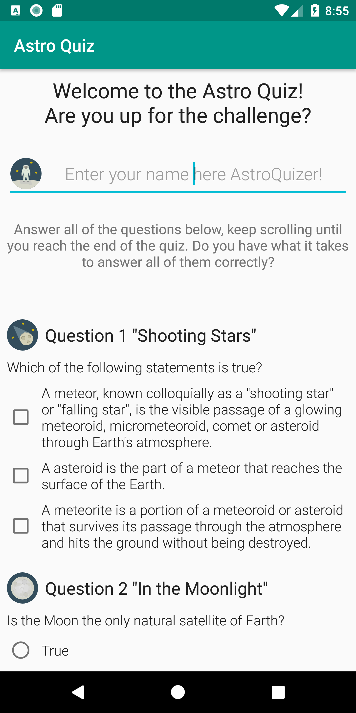
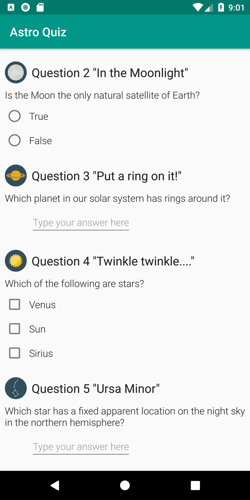
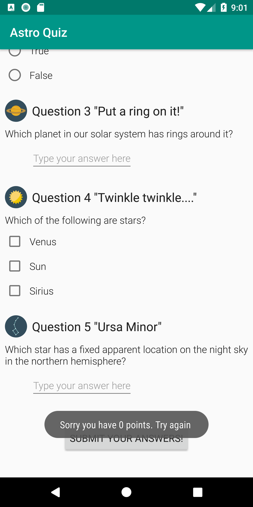
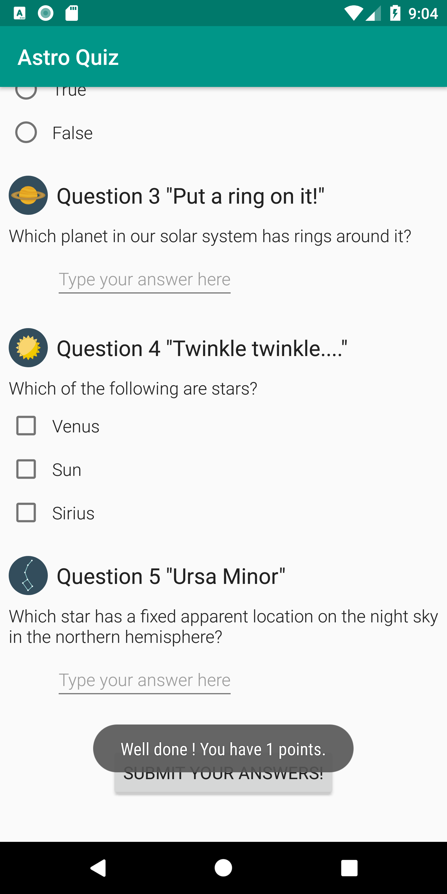
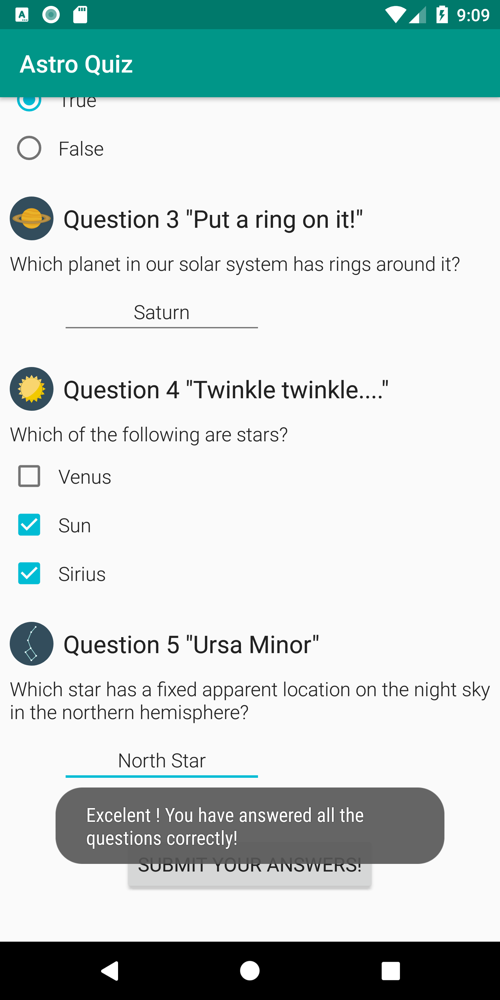

# AstroQuiz
A nice little quiz project part of my training in Android Basics.

## Description
A quiz made to test your astronomy knowledge.
It checks your answers and it prompts your results through a toast which differs depending on how many answers you got right.

## Screenshots
    
